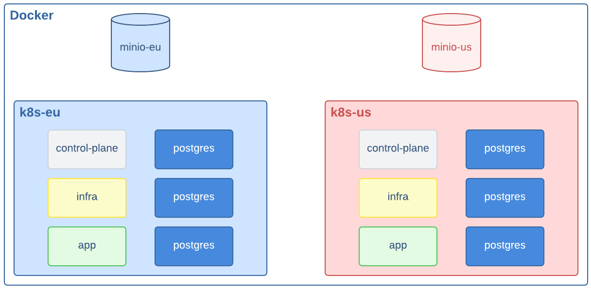

_Welcome *CNPG Playground*, a local learning environment for exploring
CloudNativePG and PostgreSQL in Kubernetes. Using Docker and Kind, it simulates
real-world scenarios, enabling developers and DBAs to experiment with
PostgreSQL replication across two clusters. Designed for hands-on learning,
*CNPG Playground* provides an accessible entry point for testing configurations
and features, with plans for future enhancements and community collaboration._

<!--more-->

---

I’m excited to share a new project I’ve been working on with Leonardo Cecchi as
part of the [CloudNativePG community](https://github.com/cloudnative-pg),
in preparation for the training session that we will have at the next
[PostgreSQL Europe Conference in Athens](https://www.postgresql.eu/events/pgconfeu2024/schedule/session/5998-mastering-postgresql-in-kubernetes-with-cloudnativepg/):
[*CNPG Playground*](https://github.com/cloudnative-pg/cnpg-playground).

This lightweight, local learning environment is designed to help developers,
DBAs, and PostgreSQL enthusiasts dive into the world of running PostgreSQL in
Kubernetes with CloudNativePG in a simple and accessible way.

## What Is CNPG Playground?

At its core, CNPG Playground is a ready-made environment that leverages Docker
and Kind (Kubernetes in Docker) to quickly set up a local space for testing,
learning, and experimenting with CloudNativePG. It's perfect for gaining
hands-on experience without the hassle of complex setups or cloud
infrastructure. Moreover, it simulates a real-world scenario with two
Kubernetes clusters in different regions, allowing PostgreSQL to replicate
across these environments using object stores. Kind creates the Kubernetes
clusters, while MinIO (running directly in Docker, outside the Kind clusters)
simulates a typical object store in the cloud.

## Why We Built This

Running stateful workloads like PostgreSQL in cloud-native applications can be
challenging. While CloudNativePG simplifies Postgres management on Kubernetes,
we recognized the need for a more accessible learning context.

*CNPG Playground* was created to provide developers and DBAs a straightforward,
low-barrier entry point to experiment with the operator in a local setting.
It’s a space to test configurations, explore features like high availability,
and see how CloudNativePG integrates with Kubernetes—all without needing a full
production setup. There’s no better way to learn than by getting your hands
dirty, and the playground offers a guided way to try out CloudNativePG’s
capabilities in a slow-paced environment conducive to learning.

## How to Get Started

Ready to give it a try? Head over to the [GitHub repository](https://github.com/cloudnative-pg/cnpg-playground)
for instructions. You’ll need Docker and Kind installed, and once you’ve got
that, you’re all set.

I’m proud of how this project has come together and excited to see how the
community will use it. If you try it out and have any feedback, suggestions, or
questions, feel free to open an issue or join the conversation on the
CloudNativePG community channels.

This is just the beginning! We plan to utilize this playground in future
training sessions with EDB, and we’re committed to improving and building upon
it. Of course, it’s open-sourced and owned by the community.

Let’s build, learn, and improve together!

---

Stay tuned for the upcoming recipes! For the latest updates, consider
subscribing to my [LinkedIn](https://www.linkedin.com/in/gbartolini/) and
[Twitter](https://twitter.com/_GBartolini_) channels.

If you found this article informative, feel free to share it within your
network on social media using the provided links below. Your support is
immensely appreciated!

_Cover Picture: [“Baby Elephant Running“](https://www.flickr.com/photos/bdu/3672992267)._
